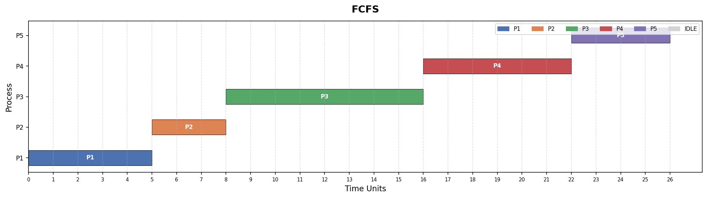
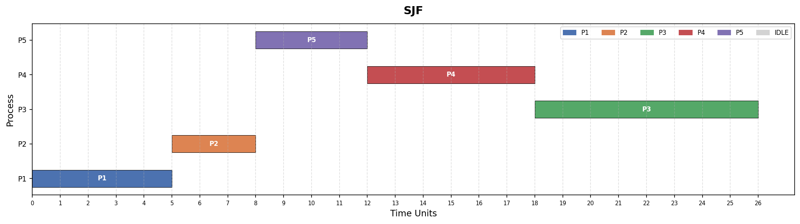
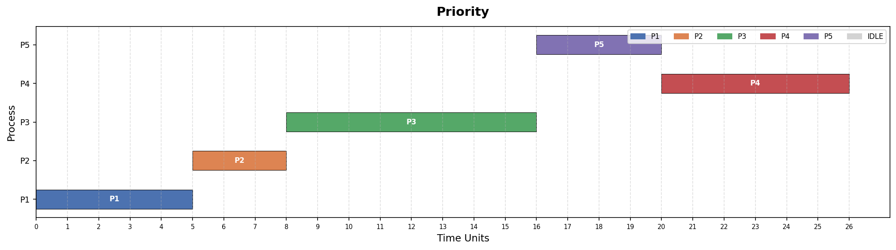
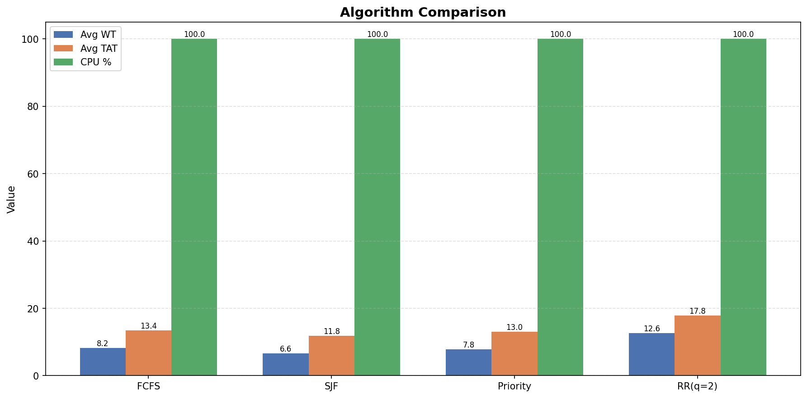

# EduOS — Operating Systems Simulator

**Module Code:** 351 CS 2104 | **Module:** Operating Systems | **Semester:** III  
**Student:** Kondwani Harawa | **Registration Number:** [Your Reg Number]  
**GitHub:** https://github.com/KondwaniHarawa/operating-system-assignment-1

EduOS is a multi-component OS simulator demonstrating process management,
thread synchronisation, IPC, and CPU scheduling using C and Python.

---

## Prerequisites
- GCC with pthread support
- Python 3.8+
- pip3, valgrind, make, git

---

## Build Instructions

### C Core
    cd c_core
    make all
    make race
    make memcheck
    make clean

### Python Scheduler
    cd python_scheduler
    pip3 install -r requirements.txt
    python3 scheduler_sim.py --file sample_processes.csv --algo all
    python3 gantt.py

### Full End-to-End
    cd c_core && make all && cd ..
    python3 controller/main_controller.py

---

## Directory Structure

    operating-system-assignment-1/
    ├── README.md                  <- this file
    ├── .gitignore                 <- ignores *.o, __pycache__, *.pyc, venv/, *.out
    ├── docs/
    │   ├── simulation_report.json <- timestamped report from controller
    │   └── screenshots/           <- Gantt and comparison charts
    ├── c_core/
    │   ├── Makefile               <- targets: all, race, fixed, memcheck, clean
    │   ├── include/eduos.h        <- shared structs: PCB, ThreadPool, Task
    │   ├── process_manager.c      <- edu_fork/exec/wait/exit/ps + JSON serialiser
    │   ├── thread_manager.c       <- thread pool, race demo, deadlock, M2O/O2O
    │   ├── ipc_module.c           <- shared memory + anonymous pipe IPC
    │   └── main_sim.c             <- driver exercising all C components
    ├── python_scheduler/
    │   ├── scheduler_sim.py       <- FCFS, SJF, Priority, RR + metrics
    │   ├── gantt.py               <- Gantt charts + comparison bar chart
    │   ├── sample_processes.csv   <- sample input (5 processes)
    │   └── requirements.txt       <- python dependencies
    └── controller/
        └── main_controller.py     <- orchestration bridge

---

## Screenshots

---

## Valgrind Output

    ==2580== HEAP SUMMARY:
    ==2580==     in use at exit: 0 bytes in 0 blocks
    ==2580==   total heap usage: 57 allocs, 57 frees, 57,774 bytes allocated
    ==2580== All heap blocks were freed -- no leaks are possible
    ==2580== ERROR SUMMARY: 0 errors from 0 contexts (suppressed: 0 from 0)

---

## Race Condition Demonstration

make race — WITHOUT mutex (non-deterministic):

| Run | Expected | Result |
|-----|----------|--------|
| 1   | 400000   | 178129 |
| 2   | 400000   | 150909 |
| 3   | 400000   | 176724 |
| 4   | 400000   | 117489 |
| 5   | 400000   | 138095 |

make fixed — WITH mutex: Result = 400000 every run

---

## Challenges Encountered

1. **WSL Network Failure** — apt update failed with Network is unreachable.
   Fix: Set DNS manually via /etc/resolv.conf and disabled auto-regeneration.

2. **Zero-warning C compilation** — Unused static functions caused warnings.
   Fix: Removed unused functions and rewrote Many-to-One demo as cooperative loop.

3. **JSON serialisation in C** — No external libraries allowed.
   Fix: Hand-rolled JSON writer using fprintf with careful comma handling.

4. **GitHub authentication in WSL** — HTTPS auth removed by GitHub.
   Fix: Generated ED25519 SSH key and switched remote to SSH.

---

## References

- Silberschatz et al., Operating System Concepts, 10th ed.
- Linux man pages: fork(2), execve(2), wait(2), pipe(2), shm_open(3)
- POSIX Threads: https://hpc-tutorials.llnl.gov/posix/
- Python subprocess: https://docs.python.org/3/library/subprocess.html
- Matplotlib: https://matplotlib.org/stable/
